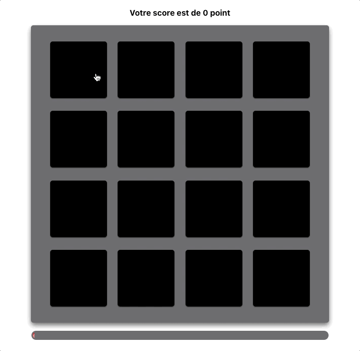

# Memory Game

A Halloween-themed Memory game developed in TypeScript, with React and Redux and some tests with Testing-Library

<br>

## Play it online :
The game can be played online here : [https://mem-game.vercel.app](https://mem-game.vercel.app)

<br>



<br>

## Test this project
> start this project with these two commands :
```sh
npm ci # install dependencies
npm start # start the project
```
<br>

### Execute the tests
```
npm run test
```